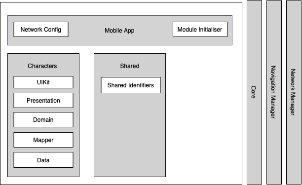
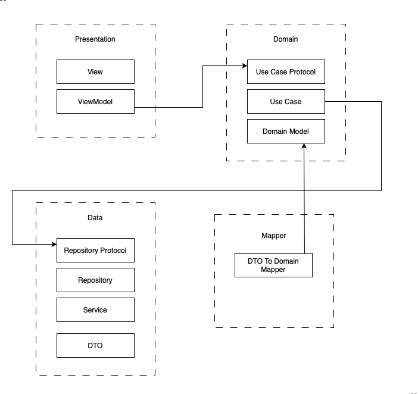
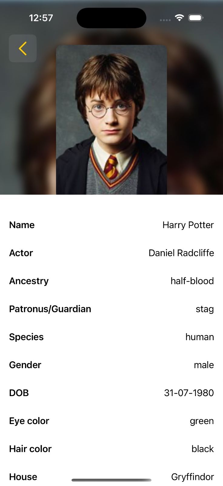
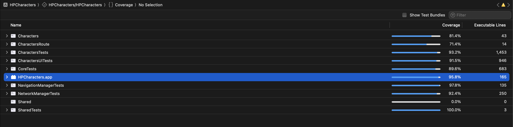

# Modular Architecture for SwiftUI

This project implements a modular architecture for SwiftUI applications, promoting clean code separation, scalability, and reusability. It consists of core and feature-specific modules organized into Swift packages.

## Overview

The architecture is built on:

- **Core Modules**: Provide foundational utilities and shared functionalities.
- **Feature Modules**: Handle distinct features of the application, encapsulating their logic, data, and presentation layers.

Each module adheres to Swift Package Manager (SPM) conventions and is compatible with iOS 14.0 and above.

## Architecture Diagram

Below is a visual representation of the modular architecture:

## Modules

### Core Modules

1. **Core**

   - **Purpose**: Provides dependency injection using Swinject and other core utilities.
   - **Dependencies**: Swinject (v2.7.0).

2. **NavigationManager**

   - **Purpose**: Manages navigation between feature modules.
   - **Dependencies**: Core.

3. **NetworkManager**

   - **Purpose**: Handles network requests and responses.
   - **Dependencies**: Core.

### Feature Modules

This feature module architecture follows Clean Architecture principles, organizing responsibilities into distinct layers: Presentation, Domain, Data, and Mapper. The Presentation layer manages the UI, the Domain layer handles business logic, the Data layer manages repositories and services, and the Mapper converts data between layers.

1. **Characters**

   - **Purpose**: Manages character-related features including data, domain, and presentation layers.
   - **Submodules**:
     - **CharactersData**: Data handling, including API interactions.
     - **CharactersDomain**: Business logic.
     - **CharactersMapper**: Maps data between layers.
     - **CharactersPresentation**: UI and presentation logic.
     - **CharactersRoute**: Defines routes for navigation.
     - **CharactersUiKit**: Shared UI components for the feature.
   - **Dependencies**:
     - Core, NetworkManager, NavigationManager, Shared.

2. **Shared**

   - **Purpose**: Contains utilities and shared resources used across modules.

## Usage

### Installation

1. Clone the repository.
2. Add the desired modules to your Swift project via Swift Package Manager.

### Adding Modules to Your Project

1. Open your Xcode project.
2. Go to `File > Add Packages`.
3. Add the modules by their respective paths or URLs.

## Features

- Decoupled architecture for maintainability.
- Dependency injection for flexibility and testability.
- Layered feature modules for clear separation of concerns.
- Support for shared utilities.

## App Screenshots

  

    
    
<strong>Student List Screen</strong> Displays the list of students with their names and details.

  

  

    
    
<strong>Student Details Screen</strong> Shows detailed information about a selected student.

  

## Unit Testing

### Running Tests

1. Open your project in Xcode.
2. Select the appropriate test scheme for the module you want to test.
3. Run tests using `Cmd + U` or by selecting `Product > Test` from the menu.

### Snapshot Tests

- All views have been covered in snapshot tests.
- Snapshot test cases are covered for iPhone 12, iOS 18.0

### Test Coverage Report

This project has an overall test coverage of 90% and above, ensuring high code quality and reliability.

## Dependencies

- [Swinject](https://github.com/Swinject/Swinject) (v2.7.0) for dependency injection.
- [SnapshotTesting](https://github.com/pointfreeco/swift-snapshot-testing) (v1.10.0) for snapshot testing.

## License

For open source projects.
